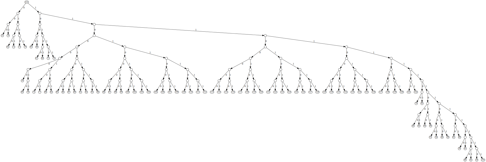
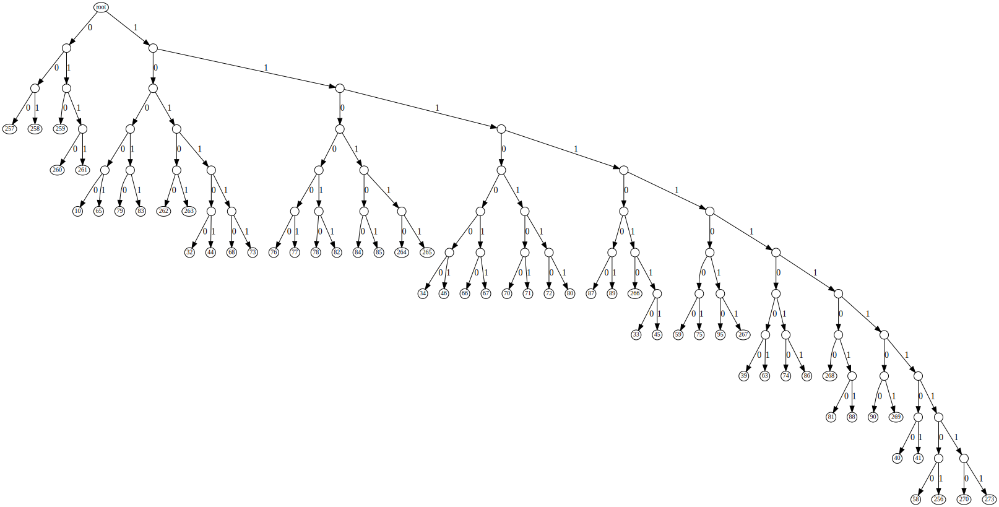
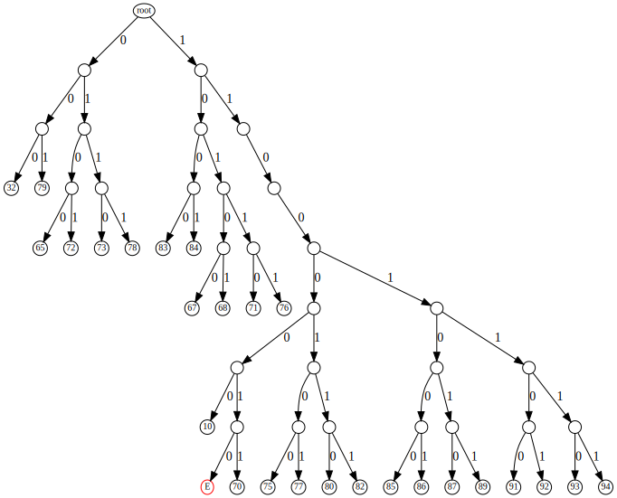

<div align="center">

#  <br> DAVID AND THE TREE

[](https://shields.io/)
[](https://shields.io/)
[](https://shields.io/)
</div>

## Prompt

> Sometimes, what's more important is not what you have, but what you're missing.  
>
> [](https://storage.googleapis.com/gctf-2021-attachments-project/fa84c8f89b39190735e175dee84b6fd55cf333195c0c45badf1f058743b52ecb97f5cb0cc5f7d04ca296f86b4c652b524e9780c40d3bf38b76a92cb71159778d)

## Files

* [attachment.zip](attachment.zip) - Challenge attachment
  - challenge.zip - Challenge zip
    - 00.txt - Gadbsy Chapter I
    - ...
    - 25.txt - Gadsby Chapter XXVI
* [compression_test.zip](compression_test.zip) - Rezipped Gadsby chapters
  - 00.txt - Gadbsy Chapter I
  - ...
  - 25.txt - Gadsby Chapter XXVI
* [solve.py](solve.py) - Challenge solver
* [visualize.py](visualize.py) - Huffman tree image generator
* [flag.txt](flag.txt) - Flag

## Solution

### Where To Look

#### File Contents?
Downloading and unzipping the attachment gives us `challenge.zip`, and unzipping that gives us 25 text files:

```
$ unzip attachment.zip
Archive:  attachment.zip
 extracting: challenge.zip

$ unzip challenge.zip
Archive:  challenge.zip
  inflating: 00.txt
  inflating: 01.txt
  inflating: 02.txt
  inflating: 03.txt
  inflating: 04.txt
  inflating: 05.txt
  inflating: 06.txt
  inflating: 07.txt
  inflating: 08.txt
  inflating: 09.txt
  inflating: 10.txt
  inflating: 11.txt
  inflating: 12.txt
  inflating: 13.txt
  inflating: 14.txt
  inflating: 15.txt
  inflating: 16.txt
  inflating: 17.txt
  inflating: 18.txt
  inflating: 19.txt
  inflating: 20.txt
  inflating: 21.txt
  inflating: 22.txt
  inflating: 23.txt
  inflating: 24.txt
  inflating: 25.txt
```

```
$ head 00.txt
I


IF YOUTH, THROUGHOUT ALL HISTORY, HAD HAD A CHAMPION TO STAND UP FOR
IT; TO SHOW A DOUBTING WORLD THAT A CHILD CAN THINK; AND, POSSIBLY,
DO IT PRACTICALLY; YOU WOULDN'T CONSTANTLY RUN ACROSS FOLKS TODAY
WHO CLAIM THAT "A CHILD DON'T KNOW ANYTHING." A CHILD'S BRAIN STARTS
FUNCTIONING AT BIRTH; AND HAS, AMONGST ITS MANY INFANT CONVOLUTIONS,
THOUSANDS OF DORMANT ATOMS, INTO WHICH GOD HAS PUT A MYSTIC POSSIBILITY
FOR NOTICING AN ADULT'S ACT, AND FIGURING OUT ITS PURPORT.
```

Google tells us that the first file is the opening chapter of [Gadsby](https://en.wikipedia.org/wiki/Gadsby_(novel)), a book famous for having no ([or very few](https://en.wikipedia.org/wiki/Gadsby_(novel)#cite_note-1)) instances of the letter 'E'. Only 26 of the 43 chapters in Gadsby are provided.

We can verify that the contents of the files are the same as the original text converted to uppercase with the following commands:

***Note**: This was run on macOS, so YMMV*

```bash
curl https://www.gutenberg.org/cache/epub/47342/pg47342.txt | # get Gadsby from Project Gutenberg
tr -d '\r'                                                  | # remove carriage returns to match provided copy
sed -n '/^I$/,/^II$/p'                                      | # extract chapter I
ghead -n -5                                                 | # remove newlines after chapter I
tr a-z A-Z                                                  | # uppercase to match provided copy
diff - 00.txt                                                 # compare with provided copy of chapter I
```

If the output of `diff` is blank, the file contents are the same. This and every other chapter are identical once carriage returns are removed and everything is converted to uppercase. So the flag must be hidden somewhere else.

#### File Metadata?
Maybe there's something hidden in the metadata. `exiftool` should tell us: 

```
$ exiftool 00.txt
ExifTool Version Number         : 12.26
File Name                       : 00.txt
Directory                       : .
File Size                       : 24 KiB
File Modification Date/Time     : 1980:01:01 00:00:00-05:00
File Access Date/Time           : 2021:07:24 14:29:24-04:00
File Inode Change Date/Time     : 2021:07:24 14:29:24-04:00
File Permissions                : -rw-------
File Type                       : TXT
File Type Extension             : txt
MIME Type                       : text/plain
MIME Encoding                   : us-ascii
Newlines                        : Unix LF
Line Count                      : 416
Word Count                      : 4421
```

Hmmm... the file modification date and time are strange. If the value is different in each file, it could be encoding some information. 

```
$ exiftool 01.txt
ExifTool Version Number         : 12.26
File Name                       : 01.txt
Directory                       : .
File Size                       : 11 KiB
File Modification Date/Time     : 1980:01:01 00:00:00-05:00
File Access Date/Time           : 2021:07:24 14:29:25-04:00
File Inode Change Date/Time     : 2021:07:24 14:29:24-04:00
File Permissions                : -rw-------
File Type                       : TXT
File Type Extension             : txt
MIME Type                       : text/plain
MIME Encoding                   : us-ascii
Newlines                        : Unix LF
Line Count                      : 192
Word Count                      : 1964
```

Nope, these are the same. [This Stack Overflow answer](https://stackoverflow.com/a/59974680/15117449) has some insight, and perhaps a hint:

> The culprit is the Python zipfile library. If you don't pass a second parameter to ZipInfo, it defaults to Jan 1, 1980: https://docs.python.org/3/library/zipfile.html#zipfile.ZipInfo

#### Challenge Zip!
At this point `challenge.zip` is the only place left to look. 

One of the many tools I used to look at the zipfile was binwalk, a utility that looks for files embedded in other files:
```
$ binwalk challenge.zip

DECIMAL       HEXADECIMAL     DESCRIPTION
--------------------------------------------------------------------------------
0             0x0             Zip archive data, at least v2.0 to extract, compressed size: 15692, uncompressed size: 24616, name: 00.txt
15728         0x3D70          Zip archive data, at least v2.0 to extract, compressed size: 10459, uncompressed size: 10937, name: 01.txt
26223         0x666F          Zip archive data, at least v2.0 to extract, compressed size: 9988, uncompressed size: 12157, name: 02.txt
36247         0x8D97          Zip archive data, at least v2.0 to extract, compressed size: 5013, uncompressed size: 8096, name: 03.txt
41296         0xA150          Zip archive data, at least v2.0 to extract, compressed size: 7895, uncompressed size: 10202, name: 04.txt
49227         0xC04B          Zip archive data, at least v2.0 to extract, compressed size: 4231, uncompressed size: 6178, name: 05.txt
53494         0xD0F6          Zip archive data, at least v2.0 to extract, compressed size: 7167, uncompressed size: 9511, name: 06.txt
60697         0xED19          Zip archive data, at least v2.0 to extract, compressed size: 3491, uncompressed size: 5833, name: 07.txt
64224         0xFAE0          Zip archive data, at least v2.0 to extract, compressed size: 5941, uncompressed size: 6565, name: 08.txt
70201         0x11239         Zip archive data, at least v2.0 to extract, compressed size: 2701, uncompressed size: 3695, name: 09.txt
72938         0x11CEA         Zip archive data, at least v2.0 to extract, compressed size: 6258, uncompressed size: 9301, name: 10.txt
79232         0x13580         Zip archive data, at least v2.0 to extract, compressed size: 3813, uncompressed size: 5386, name: 11.txt
83081         0x14489         Zip archive data, at least v2.0 to extract, compressed size: 9042, uncompressed size: 13016, name: 12.txt
92159         0x167FF         Zip archive data, at least v2.0 to extract, compressed size: 5174, uncompressed size: 7719, name: 13.txt
97369         0x17C59         Zip archive data, at least v2.0 to extract, compressed size: 5330, uncompressed size: 8947, name: 14.txt
102735        0x1914F         Zip archive data, at least v2.0 to extract, compressed size: 3916, uncompressed size: 5701, name: 15.txt
106687        0x1A0BF         Zip archive data, at least v2.0 to extract, compressed size: 5771, uncompressed size: 7701, name: 16.txt
112494        0x1B76E         Zip archive data, at least v2.0 to extract, compressed size: 7661, uncompressed size: 12730, name: 17.txt
120191        0x1D57F         Zip archive data, at least v2.0 to extract, compressed size: 5872, uncompressed size: 6773, name: 18.txt
126099        0x1EC93         Zip archive data, at least v2.0 to extract, compressed size: 4259, uncompressed size: 6001, name: 19.txt
130394        0x1FD5A         Zip archive data, at least v2.0 to extract, compressed size: 2627, uncompressed size: 3990, name: 20.txt
133057        0x207C1         Zip archive data, at least v2.0 to extract, compressed size: 2658, uncompressed size: 3968, name: 21.txt
135751        0x21247         Zip archive data, at least v2.0 to extract, compressed size: 2698, uncompressed size: 3655, name: 22.txt
138485        0x21CF5         Zip archive data, at least v2.0 to extract, compressed size: 1677, uncompressed size: 2659, name: 23.txt
140198        0x223A6         Zip archive data, at least v2.0 to extract, compressed size: 5812, uncompressed size: 7568, name: 24.txt
146046        0x23A7E         Zip archive data, at least v2.0 to extract, compressed size: 3564, uncompressed size: 5391, name: 25.txt
150998        0x24DD6         End of Zip archive, footer length: 22
```

No files out of the ordinary here, but the compressed/uncompressed size is interesting. I would expect that all uppercase English text would have a much higher compression rate than what's seen here. We can confirm this by zipping up the chapters and comparing:

```
zip -rq compression_test.zip *.txt && binwalk compression_test.zip

DECIMAL       HEXADECIMAL     DESCRIPTION
--------------------------------------------------------------------------------
0             0x0             Zip archive data, at least v2.0 to extract, compressed size: 10169, uncompressed size: 24616, name: 00.txt
10233         0x27F9          Zip archive data, at least v2.0 to extract, compressed size: 4766, uncompressed size: 10937, name: 01.txt
15063         0x3AD7          Zip archive data, at least v2.0 to extract, compressed size: 5358, uncompressed size: 12157, name: 02.txt
20485         0x5005          Zip archive data, at least v2.0 to extract, compressed size: 3587, uncompressed size: 8096, name: 03.txt
24136         0x5E48          Zip archive data, at least v2.0 to extract, compressed size: 4481, uncompressed size: 10202, name: 04.txt
28681         0x7009          Zip archive data, at least v2.0 to extract, compressed size: 2801, uncompressed size: 6178, name: 05.txt
31546         0x7B3A          Zip archive data, at least v2.0 to extract, compressed size: 4285, uncompressed size: 9511, name: 06.txt
35895         0x8C37          Zip archive data, at least v2.0 to extract, compressed size: 2653, uncompressed size: 5833, name: 07.txt
38612         0x96D4          Zip archive data, at least v2.0 to extract, compressed size: 2953, uncompressed size: 6565, name: 08.txt
41629         0xA29D          Zip archive data, at least v2.0 to extract, compressed size: 1771, uncompressed size: 3695, name: 09.txt
43464         0xA9C8          Zip archive data, at least v2.0 to extract, compressed size: 4158, uncompressed size: 9301, name: 10.txt
47686         0xBA46          Zip archive data, at least v2.0 to extract, compressed size: 2531, uncompressed size: 5386, name: 11.txt
50281         0xC469          Zip archive data, at least v2.0 to extract, compressed size: 5570, uncompressed size: 13016, name: 12.txt
55915         0xDA6B          Zip archive data, at least v2.0 to extract, compressed size: 3575, uncompressed size: 7719, name: 13.txt
59554         0xE8A2          Zip archive data, at least v2.0 to extract, compressed size: 3929, uncompressed size: 8947, name: 14.txt
63547         0xF83B          Zip archive data, at least v2.0 to extract, compressed size: 2651, uncompressed size: 5701, name: 15.txt
66262         0x102D6         Zip archive data, at least v2.0 to extract, compressed size: 3476, uncompressed size: 7701, name: 16.txt
69802         0x110AA         Zip archive data, at least v2.0 to extract, compressed size: 5624, uncompressed size: 12730, name: 17.txt
75490         0x126E2         Zip archive data, at least v2.0 to extract, compressed size: 3063, uncompressed size: 6773, name: 18.txt
78617         0x13319         Zip archive data, at least v2.0 to extract, compressed size: 2808, uncompressed size: 6001, name: 19.txt
81489         0x13E51         Zip archive data, at least v2.0 to extract, compressed size: 1931, uncompressed size: 3990, name: 20.txt
83484         0x1461C         Zip archive data, at least v2.0 to extract, compressed size: 1933, uncompressed size: 3968, name: 21.txt
85481         0x14DE9         Zip archive data, at least v2.0 to extract, compressed size: 1717, uncompressed size: 3655, name: 22.txt
87262         0x154DE         Zip archive data, at least v2.0 to extract, compressed size: 1294, uncompressed size: 2659, name: 23.txt
88620         0x15A2C         Zip archive data, at least v2.0 to extract, compressed size: 3402, uncompressed size: 7568, name: 24.txt
92086         0x167B6         Zip archive data, at least v2.0 to extract, compressed size: 2436, uncompressed size: 5391, name: 25.txt
96562         0x17932         End of Zip archive, footer length: 22
```

As suspected, the compressed size of the files is much smaller than in `challenge.zip`! Maybe there's a different compression algorithm at play?

```
$ exiftool challenge.zip | grep "Zip Compression"
Zip Compression                 : Deflated

$ exiftool compression_test.zip | grep "Zip Compression"
Zip Compression                 : Deflated
```

Nope! Same. Time to read about how zip files work and how data might be hidden in them.

### David Huffman and his Tree
[Wikipedia's Deflate](https://en.wikipedia.org/wiki/Deflate) page tells us about the two types of compression that Deflate uses: 

> Deflate is a lossless data compression file format that uses a combination of LZSS and Huffman coding. It was designed by Phil Katz, for version 2 of his PKZIP archiving tool. Deflate was later specified in RFC 1951 (1996).

["An Explanation of the *Deflate* Algorithm"](https://zlib.net/feldspar.html) has a great explanation of how those two components work. LZ77 finds and compresses repeated sequences of data and Huffman coding is a clever way of reducing the number of bits needed to represent each symbol in a file. I chose to focus on Huffman coding because of this information in its [Wikipedia Page](https://en.wikipedia.org/wiki/Huffman_coding):

1. ***David*** Huffman developed the algorithm
2. The algorithm uses a Huffman ***Tree*** to find the optimal prefix code

We usually think of files in terms of bytes. Files containing ASCII text like the ones in `challenge.zip` represent each character using one byte. One byte can represent 256 different symbols, but lots of files waste space by not using all 256 possibilities. We can see how many unique characters are in `00.txt` with this script:

```bash
$ od -tx1 -An 00.txt    | # print each byte of chapter I in hex, space-separated, with no address base
tr ' ' '\n'             | # replace space with newline 
sort -n                 | # sort numerically 
uniq                    | # remove duplicate lines
wc -w                     # get word count (number of unique bytes in chapter I)

      39
```

Only 39 different byte values are represented in the first chapter! This file could be so much smaller if each character only needed 6 bits. Reducing the number of bits needed to represent each symbol based on this metric is one way to compress a file, but Huffman coding is much better. Huffman coding is a [variable-length code](https://en.wikipedia.org/wiki/Variable-length_code) that can use fewer bits to represent the most common symbols and increase the number of bits for less common symbols. 

In this example of a Huffman tree for the text "this is an example of a huffman tree" by [Metaficha](https://commons.wikimedia.org/w/index.php?curid=2875155), the encoding for each character can be found by following the tree from the root to each leaf, adding a '0' bit if taking the left path or '1' if taking the right. the most frequent symbols are encoded with only three bits despite needing to represent 16 different symbols from the uncompressed string:

* ' ': `111` 
* 'e': `000`
* 'a': `010`

<div align="center">


</div>

### Tree Climbing
Now that we know what a Huffman tree is, it's time to see if we can find anything strange in the Huffman tree of each compressed chapter. To extract the tree and learn more about how the Deflate algorithm works, I used the article ["Let's implement `zlib.decompress()`"](https://pyokagan.name/blog/2019-10-18-zlibinflate/) by [Paul Tan](https://pyokagan.name/). 

Paul's code expects `zlib` data, which is just the raw, compressed deflate data wrapped in a small header and footer. We can modify the code to skip the `zlib` wrapper parsing/verification and just assume the data we supply is correct. Then we can parse the zip file to extract the data we need and then send it to the tree parser: 

```python
# extract raw compressed data from zip file
def carve(zip_name, metadata_size):
    # list of tuples, (offset, size)
    files = []
    # parse zip file
    with zipfile.ZipFile(zip_name, 'r') as zip_file:
        # iterate over each file in zip
        for elem in zip_file.infolist():
            offset = elem.header_offset + metadata_size
            compress_size = elem.compress_size
            files.append((offset, compress_size))

    compressed_data = []
    with open(zip_name, 'rb') as raw_zip:
        for f in files:
            # seek to offset and read compressed_size bytes
            raw_zip.seek(f[0])
            compressed_data.append(raw_zip.read(f[1]))

    return compressed_data
```

```python
# parse raw compressed data to get huffman tree (ignore distance tree)
def get_huffman_tree(raw):
    r = BitReader(raw)
    # read BFINAL and BTYPE
    BFINAL = r.read_bit()
    BTYPE = r.read_bits(2)
    literal_length_tree, distance_tree = decode_trees(r)
    return literal_length_tree 
```

```python
if __name__ == "__main__":
    # get raw compressed data from challenge.zip
    challenge_data = carve('challenge.zip', 0x24)

    # extract huffman tree, inserter will print when 'E' character is inserted 
    for i, f in enumerate(challenge_data):
        print(get_huffman_tree(f))
```

This seems to work, but it's hard to tell if anything out of the ordinary is present. Graphing a tree from `compression_test.zip` and comparing side-by-side with the same one from `challenge.zip` is a better way to highlight any differences.

```python
# make networkx graph from huffman tree
def walk_graph(self, node, parent, g, edge_label=None):
    # root of tree
    if not parent:
        g.add_node(node.symbol, label='root')
    else:
        # leaf node
        if node.symbol > 0:
            label = node.symbol
        # intermediate node
        else:
            label = ''
        g.add_node(node.symbol, label=label)
        g.add_edge(parent.symbol, node.symbol, label=edge_label)
    if node.left:
        self.walk_graph(node.left, node, g, '0')
    if node.right:
        self.walk_graph(node.right, node, g, '1')
    return g
```

```python
# generate image from a given huffman tree
def visualize(huffman_tree, output_name):
    g = huffman_tree.make_graph()
    A = nx.drawing.nx_agraph.to_agraph(g)
    A.layout('dot', args='-Nfontsize=10 -Nwidth=".2" -Nheight=".2" -Nmargin=0 -Gfontsize=8')
    A.draw(output_name)
    print(f'Graph generated: {output_name}')
```

Applying the new visualization functionality to the first compressed file in both `challenge.zip` and `compression_test.zip` produces the following graphs:

<div align="center">


</div>

<div align="center">


</div>

Wow. This comparison shows us that the first Huffman tree in `challenge.zip` contains far more nodes than necessary. Any leaf node between 0 and 255 should represent the base 10 value of an ASCII character within the file `00.txt`. As we figured out earlier, there should only be 39 of these. Our compressed example tree for `00.txt` is correct with 39 literal leaf nodes (the 16 other nodes can be ignored, they're used for the LZ77 algorithm). 

`challenge.zip`, on the other hand, has 90 literal leaf nodes. There must be some data encoded in the trees of the files that we have to decipher...

It's hard to see right now, but the `challenge.zip` graph has one very interesting and unusual node that stands out. We would expect to see the more frequent literals towrd the left side of the graph because that's where the shortest paths from the root to the leaves are. One node that we should not expect to see at all, and certainly not on the left side, is of course the node for the literal 'E'. By graphing just the most frequent nodes and highlighting the 'E' it becomes more clear:

<div align="center">


</div>

Another suspicious attribute of this graph is that there are exactly 8 edges between the 'E' and the root node. Walking down from the root, we get a bit-pattern of `11000010`. Let's see if that turns into anything interesting when converted to ASCII:

```python
>>> chr(int('11000010', 2))
'Â'
```

This could be something, but I was hoping more for a 'C'. Maybe if we go backwards?

```python
>>> chr(int('11000010'[::-1], 2))
'C'
``` 

There we go! And if we do the same thing with the rest of the compressed files I bet we can get the flag. To automate the process, we can add a condition that detects whenever the '69' literal gets inserted into a Huffman tree and then trace the path it takes. If we print each character as each tree is built we should get the flag!

```python
def insert(self, codeword, n, symbol):
    # Insert an entry into the tree mapping `codeword` of len `n` to `symbol`
    node = self.root

    # if inserting symbol 69 ('E'), follow bit path
    p = False
    bits = b''
    if symbol == 69:
        p = True
    for i in range(n-1, -1, -1):
        b = codeword & (1 << i)
        if b:
            bits += b'1'
            next_node = node.right
            if next_node is None:
                node.right = Node()
                next_node = node.right
        else:
            bits += b'0'
            next_node = node.left
            if next_node is None:
                node.left = Node()
                next_node = node.left
        node = next_node
    # print bit path in reverse to get character of flag
    if p:
        print(chr(int(bits[::-1], 2)), end='')
    
    node.symbol = symbol
```

```
$ python solve.py
CTF{!-!OLE-E-COM!7RESSION}
```

<div align="center">


</div>

## Resources

* **Wikipedia Gadsby**: https://en.wikipedia.org/wiki/Gadsby_(novel)
* **Project Gutenberg Gadsby**: https://www.gutenberg.org/ebooks/47342
* **exiftool**: https://github.com/exiftool/exiftool
* **January 1, 1980 Stack Overflow**: https://stackoverflow.com/a/59974680/15117449
* **binwalk**: https://github.com/ReFirmLabs/binwalk
* **Wikipedia ZIP**: https://en.wikipedia.org/wiki/ZIP_(file_format)
* **Wikipedia Deflate**: https://en.wikipedia.org/wiki/Deflate
* **An explanation of the *Deflate* Algorithm**: https://zlib.net/feldspar.html
* **Wikipedia Huffman coding**: https://en.wikipedia.org/wiki/Huffman_coding
* **Wikipedia Variable-length code**: https://en.wikipedia.org/wiki/Variable-length_code
* **Meteficha Huffman Tree**: https://commons.wikimedia.org/w/index.php?curid=2875155
* **Paul Tan's Let's implement `zlib.decompress()`**: https://pyokagan.name/blog/2019-10-18-zlibinflate/
* **Wikipedia zlib**: https://en.wikipedia.org/wiki/Zlib
